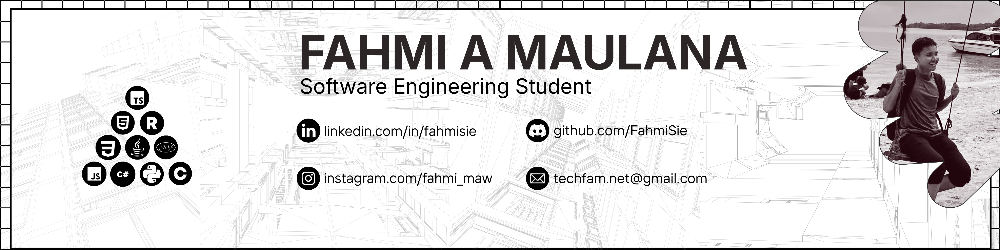

 

- 🌍  I'm based in Indonesia
- 🖥️  See my profile at [famsocial.xyz](https://famsocial.xyz)
- ✉️  You can contact me at [techfam.net@gmail.com](mailto:techfam.net@gmail.com)
- 📖  I'm currently learning Android Development and Web Development (Fullstack)
- 🏫  I'm a student at [SMK Telkom Malang](https://smktelkom-mlg.sch.id)

---

### Socials

&nbsp;
&nbsp;
&nbsp;
&nbsp;
&nbsp;

---

### Languages and Tools

---

### My Github Stats

